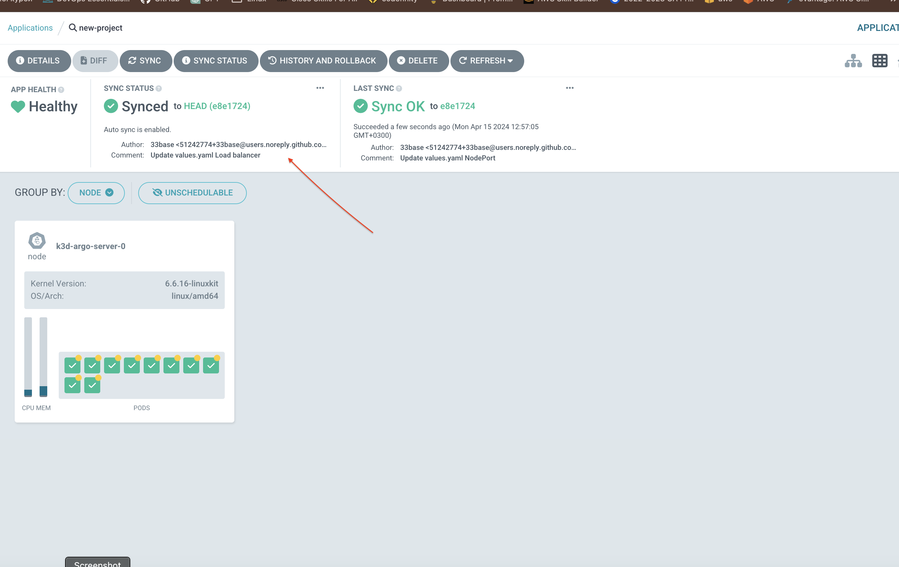

# MVP Deployment Instructions

Follow these steps to deploy the MVP using ArgoCD to track changes from the GitHub repository [go-demo-app](https://github.com/den-vasyliev/go-demo-app) and set up automatic synchronization:

1. **Access ArgoCD UI:**
   - Navigate to `http://localhost:8080` in your browser.

2. **Login to ArgoCD:**
   - Use the username 'admin' and the password obtained in the previous section.
   
3. **Add Application in ArgoCD:**
   - Click on the 'New App' button.
   
   - Fill in the following details:
     - Application Name: `project1`
     - Project: `default`
     - Repository URL: `https://github.com/den-vasyliev/go-demo-app`
     - Revision: `HEAD`
     - Path: `helm`
     - Sync Policy: `Manual`
     - AUTO-CREATE NAMESPACE - tick
    
4. **Deploy Application:**
   - Click on 'Create' to deploy the application.
    
5. **Verify Deployment:**
   - Once the application is deployed, verify its status in the ArgoCD UI.
   - Check for any errors or warnings in the deployment process.
    
6. **Sync Changes:**
   - Make changes to the GitHub repository [go-demo-app](https://github.com/den-vasyliev/go-demo-app).
   - Commit and push the changes.
    

7. **Automatic Synchronization:**
   - ArgoCD should automatically detect the changes pushed to the repository and synchronize the application accordingly.

After completing these steps, the MVP should be successfully deployed using ArgoCD, demonstrating automatic synchronization of changes from the GitHub repository to the Kubernetes cluster.
